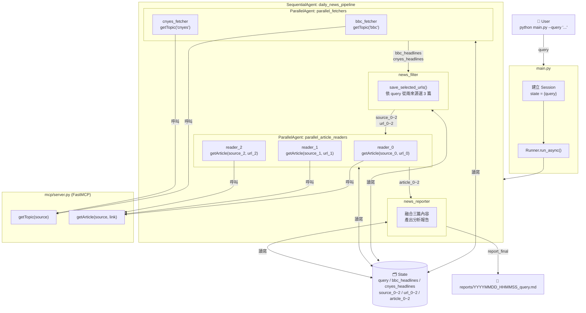

```mermaid
flowchart TD
    User["👤 User\npython main.py --query '...'"]
    State[("🗂️ State\nquery / bbc_headlines / cnyes_headlines\nsource_0~2 / url_0~2 / article_0~2")]

    User -->|query| Main

    subgraph Main["main.py"]
        Session["建立 Session\nstate = {query}"]
        Runner["Runner.run_async()"]
        Session --> Runner
    end

    Runner --> Pipeline

    subgraph Pipeline["SequentialAgent: daily_news_pipeline"]
        direction TB

        subgraph ParallelFetchers["ParallelAgent: parallel_fetchers"]
            direction LR
            BBC["bbc_fetcher\ngetTopic('bbc')"]
            CNYES["cnyes_fetcher\ngetTopic('cnyes')"]
        end

        subgraph Filter["news_filter"]
            F_tool["save_selected_urls()\n依 query 從兩來源選 3 篇"]
        end

        subgraph ParallelReaders["ParallelAgent: parallel_article_readers"]
            direction LR
            R0["reader_0\ngetArticle(source_0, url_0)"]
            R1["reader_1\ngetArticle(source_1, url_1)"]
            R2["reader_2\ngetArticle(source_2, url_2)"]
        end

        subgraph Reporter["news_reporter"]
            REP["融合三篇內容\n產出分析報告"]
        end

        ParallelFetchers -->|bbc_headlines\ncnyes_headlines| Filter
        Filter -->|source_0~2\nurl_0~2| ParallelReaders
        ParallelReaders -->|article_0~2| Reporter
    end

    ParallelFetchers <-->|讀寫| State
    Filter <-->|讀寫| State
    ParallelReaders <-->|讀寫| State
    Reporter <-->|讀寫| State

    subgraph MCP["mcp/server.py (FastMCP)"]
        getTopic["getTopic(source)"]
        getArticle["getArticle(source, link)"]
    end

    BBC -->|呼叫| getTopic
    CNYES -->|呼叫| getTopic
    R0 & R1 & R2 -->|呼叫| getArticle

    Reporter -->|report_final| Output["📄 reports/YYYYMMDD_HHMMSS_query.md"]
```
